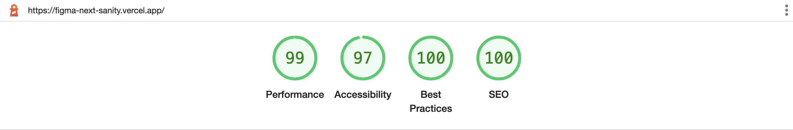
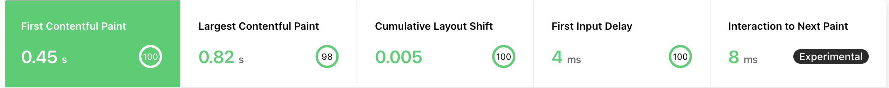

# Figma - David Choi - Web Developer, Web Experience

> Inspired by [figma.com/careers](https://www.figma.com/careers)

## David's Solution

Front End application using [React.js](https://reactjs.org/) for UI, [Next.js](https://nextjs.com/) for SSR and setup, [Styled Components](https://styled-components.com/) for CSS in JS consuming data from [Sanity](https://sanity.io/), deployed through [Vercel](https://vercel.com/)

- Copied the style and content from figma.com
- Created my own React Components writing CSS in JS with Styled Components
- Used Next.js for routing, image optimization, and everything else to help get my project production ready quickly
- Sanity Studio running on localhost and deployed in the [cloud](https://www.sanity.io/docs/deployment).
- Next.js deployed with the [Sanity Vercel Integration](https://www.sanity.io/docs/vercel-integration).

## Analytics

### Lighthouse Scores 



### Web Vitals



## Dev Setup

[Initial Setup](./docs/README.md)

### Step 1. Run Next.js locally in development mode

```bash
yarn install && yarn dev
```

Your webapp should be up and running on [http://localhost:3000](http://localhost:3000)!

### Step 2. Populate content

In another terminal start up the studio:

```bash
npm run studio:dev
```

Your studio should be up and running on [http://localhost:3333](http://localhost:3333)!

## View deployed production application

1. Go to [https://figma-next-sanity.vercel.app/](https://figma-next-sanity.vercel.app/)
